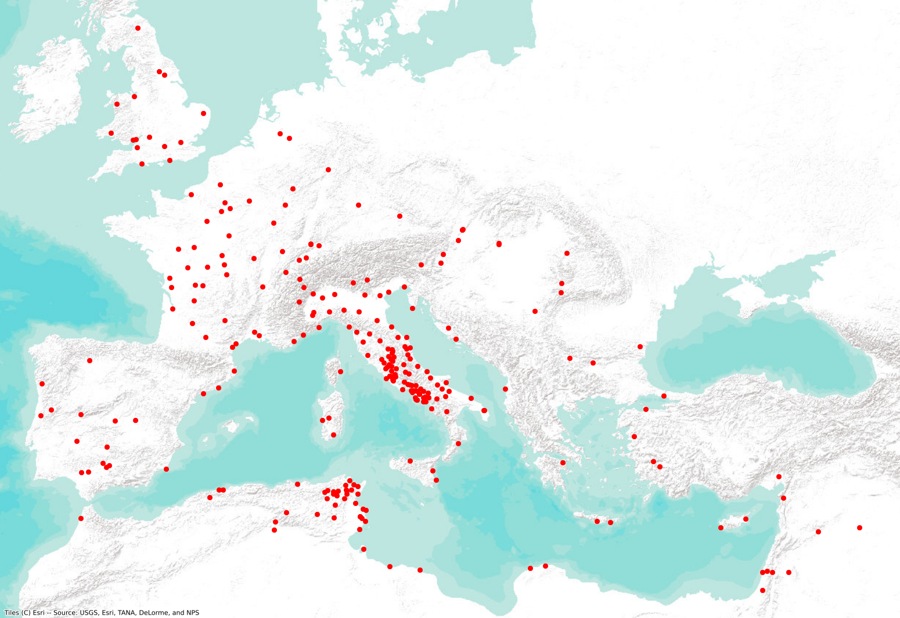

# About

'roman-amphitheaters' is a digital resource that collects information about Roman amphitheaters with a primary goal being the easy use of its data in a wide variety of computational environments. It is designed to support open-ended inquiry into the place and role of amphitheaters in the Roman Empire. Please do note that 'roman-amphitheaters' is a developing resource that is regularly updated, improved, and corrected.

The file **'roman-amphitheaters.geojson' holds the latest information** and is the source for other derived files, including 'roman-amphitheaters.csv' and the basic maps provided as a convenience. The 'utility.ipynb' jupyter notebook generates these other files.

By default, github will display the '[roman-amphitheaters.geojson](roman-amphitheaters.geojson)' file as a map.

Discussion of one approach to using this data, with links to interactive code, is available in the article: S. Heath. 2021. "Applied Use of JSON, GeoJSON, JSON-LD, SPARQL, and IPython Notebooks for Representing and Interacting with Small Datasets." In S. E. Bond, P. Dilley, and R. Horne, eds. *Linked Open Data for the Ancient Mediterranean: Structures, Practices, Prospects*. ISAW Papers 20. http://dlib.nyu.edu/awdl/isaw/isaw-papers/20-13/ .

See also: S. Heath. 2022. “Narrating Transitions and Transformations in Cultural Heritage Digital Workflows Using a JSON-Encoded Dataset of Roman Amphitheaters.” In Digital Heritage And Archaeology In Practice: Data, Ethics, And Professionalism, edited by Ethan Watrall and Lynn Goldstein, 71–97. Gainesville. https://muse.jhu.edu/book/101232

A nice example of 3rd party use of this data is: Gebhard, Christian A. 2022. “When Not in Rome...” *Jolly Data* (blog). July 8, 2022. https://jollydata.blog/posts/2022-06-12-when-not-in-rome/.

A draft of the article *Estimating and Mapping Roman Amphitheater Seating Capacity* is available at https://www.academia.edu/88351135/Estimating_and_Mapping_Roman_Amphitheater_Seating_Capacity

Note: The information here continues to change over time. An ongoing focus is entering more direct citation of sources into the 'roman-amphitheaters.geojson' file. Towards this goal, I have made small steps towards implementing a flexible bibliographic infrastructure for this dataset in Zotero. See https://www.zotero.org/groups/2900686/roman_amphitheaters . The number of titles currently included there is very small and only slowly growing. But growing nonetheless. A likewise slowly growing number of amphitheater descriptions have bibliographic citations and a Zotero item identifier for each title. The .csv file will sometimes have the first Zotero identifier. It is a goal to make an html rendering of this information that includes working links to the online version of the Zotero items.

# Maps
This map shows the locations of all structures recorded in the dataset.

'[all-roman-amphitheaters-map-dark.png](all-roman-amphitheaters-map-dark.png)' shows the same locations on a black basemap of Roman territory in 200 CE. The base map is derived from files provided by the [Ancient World Mapping Center](http://awmc.unc.edu/wordpress/).

# QGIS
As a further convenience, the file 'roman-amphitheaters.qgz' is a simple [QGIS](https://qgis.org/) project file that loads the geojson and uses the '[Digital Atlas of the Roman Empire](https://dh.gu.se/dare/)' tileset as a basemap. If the map is blank when that file is opened, choose the "Zoom to Layer(s)" item from the "View" menu.

# Other Resources

Amphitheaters are well represented on the public internet. The following digital resources are especially useful when looking for further information, bibliography, and images. All have been used in the compilation of this data and there are often links to these sites in the descriptions of individual amphitheaters.

* https://amphi-theatrum.de
* https://dh.gu.se/dare/
* https://www.livius.org
* https://pleiades.stoa.org
* https://vici.org/
* http://www.wikidata.org/entity/Q7362268 (See "What links here".)
* https://en.wikipedia.org/wiki/List_of_Roman_amphitheatres

Two concsise and useful overall discussions of amphitheaters are:

* Dodge, Hazel. “Amphitheater.” In *Encyclopedia of Global Archaeology*, edited by Claire Smith, 197–201. New York, NY: Springer, 2014. https://doi.org/10.1007/978-1-4419-0465-2_1469 .

* Forni, G. “Anfiteatro.” In *Enciclopedia Dell’ Arte Antica*, 1958. https://www.treccani.it/enciclopedia/anfiteatro_(Enciclopedia-dell'-Arte-Antica) .

