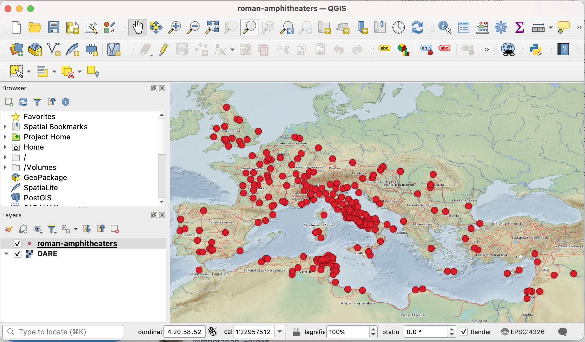

The file 'roman-amphitheaters.geojson' holds the latest information and is the source for other derived files, including 'roman-amphitheaters.csv'. The 'utility.ipynb' generates these other files.

By default, githib will display the '[roman-amphitheaters.geojson](roman-amphitheaters.geojson)' file as a map.

Discussion of one approach to using this data, with links to interactive code, is available in the article: S. Heath. 2021. "Applied Use of JSON, GeoJSON, JSON-LD, SPARQL, and IPython Notebooks for Representing and Interacting with Small Datasets. In S. E. Bond, P. Dilley, and R. Horne, eds. *Linked Open Data for the Ancient Mediterranean: Structures, Practices, Prospects*. ISAW Papers 20. <http://dlib.nyu.edu/awdl/isaw/isaw-papers/20-13/>.

Note: The information here continues to change over time. An ongoing focus is entering more direct citation of sources into the 'roman-amphitheaters.geojson' file. Towards this goal, I have made small steps towards implementing a flexible bibliographic infrastructure for this dataset in Zotero. See https://www.zotero.org/groups/2900686/roman_amphitheaters . The number of titles currently included there is very small and only slowly growing. But growing nonetheless. A likewise slowly growing number of amphitheater descriptions have bibliographic citations and a Zotero item identifier for each title. The .csv file will sometimes have the first Zotero identifier. It is a goal to make an html rendering of this information that includes working links to the online version of the Zotero items.

As a convenience, the file 'roman-amphitheaters.qgz' is a simple QGIS project file that loads the geojson and uses the '[Digital Atlas of the Roman Empire](https://dh.gu.se/dare/)' tileset as a basemap. If the map is blank when that file is opened, choose the "Zoom to Layer(s)" item from the "View" menu.

